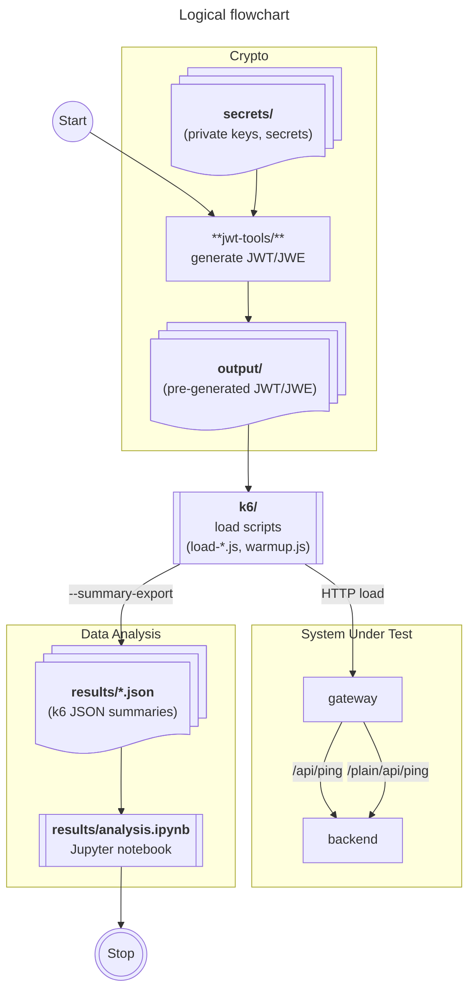

# JWT/JWE Spring Cloud Gateway Performance Bench

A reproducible benchmark suite for measuring **signature-verification** and **JWE-decryption** cost inside **Spring Cloud Gateway 2025.x** (Java 21, Nimbus JOSE).  
Each request carries a **unique token** to avoid hot-path inlining and show real event-loop crypto overhead.

## How it works

Gateway classifies tokens on the fly:

- **HS256 / RS256 / ES256** → `SignedJWT.parse` → `MACVerifier` / `RSASSAVerifier` / `ECDSAVerifier`
- **JWE** → `JWEObject.parse` → `RSADecrypter` (RSA-OAEP + AES-GCM)

Backend is intentionally trivial. The only measurable components are:

- Nimbus parsing & crypto;
- SCG routing;
- Netty event-loop saturation under pressure.

Token uniqueness removes JVM inline-caching and signature-reuse artifacts.

## Running the full benchmark

The `run.sh` script automates the end-to-end workflow: handles environment validation, dependency setup, 
token generation, container startup, readiness checks, and sequential execution of all k6 workloads.

See the script source for the exact sequence of operations.

## What the bench reveals

- throughput changes across HS256 → RS256 → ES256 → JWE;
- latency behavior per algorithm;
- pressure on the Netty/SCG event loop;
- impact of raw cryptography with routing, without any application logic.

See [analysis.ipynb](results/analysis.ipynb) for the full analysis.

## License

This work is licensed under **CC BY-SA-4.0**. See [`LICENSE.md`](LICENSE.md) for attribution requirements.
