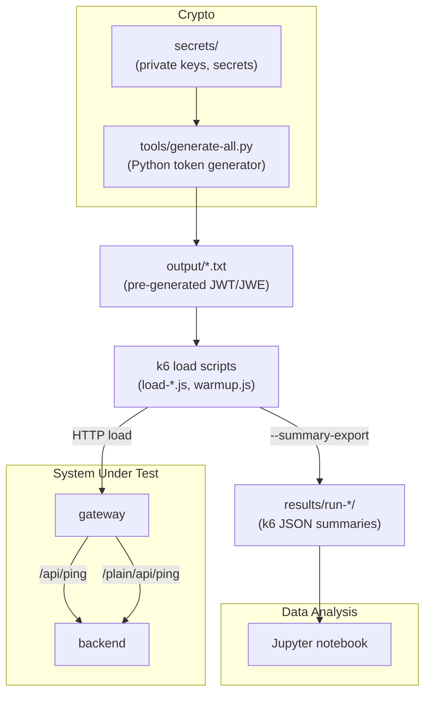

# JWT/JWE Spring Cloud Gateway Performance Bench

A reproducible benchmark suite for measuring **signature-verification** and **JWE-decryption** cost inside **Spring Cloud Gateway 2025.x** (Java 21, Nimbus JOSE).  
Each request carries a **unique token** to avoid hot-path inlining and show real event-loop crypto overhead.

## Logical flowchart



## How it works

Gateway classifies tokens on the fly:

- **HS256 / RS256 / ES256** → `SignedJWT.parse` → `MACVerifier` / `RSASSAVerifier` / `ECDSAVerifier`
- **JWE** → `JWEObject.parse` → `RSADecrypter` (RSA-OAEP + AES-GCM)

Backend is intentionally trivial. The only measurable components are:

- Nimbus parsing & crypto
- SCG routing
- Netty event-loop saturation under pressure

Token uniqueness removes JVM inline-caching and signature-reuse artifacts.

## Running the full benchmark

The root script automates everything:

```bash
./run.sh
```

It performs:

1. prerequisite checks (docker, python)
2. k6 download (if missing)
3. Python venv prep (`tools/`)
4. token generation (HS256/RS256/ES256/JWE → `output/`)
5. `docker compose up -d` (backend + gateway)
6. health-wait on `/actuator/health`
7. sequential execution of all k6 scripts
8. teardown (`docker compose down` via trap)

Tokens remain cached in `output/` for repeated runs.

## Manual execution (optional)

1. Generate keys as described in [`secrets/README.md`](secrets/README.md).
2. Generate JWT/JWE as described in [`tools/README.md`](tools/README.md).
3. Run docker-compose and start k6 tests:

```bash
docker compose up -d --build

./k6 run k6/load-hs256.js
./k6 run k6/load-rs256.js
./k6 run k6/load-es256.js
./k6 run k6/load-jwe.js
```

## What the bench reveals

* relative RPS drop across HS256 → RS256 → ES256 → JWE
* per-algorithm latency characteristics
* Netty/SCG event-loop pressure points
* effect of pure crypto vs routing with zero application logic

The bench isolates **pure verification/decryption cost**.
There is deliberately no DB, cache, OAuth, or user-profile lookups.

See [analysis.ipynb](results/analysis.ipynb) for the details.

## License

This work is licensed under **CC BY-SA-4.0**.
See [`LICENSE.md`](LICENSE.md) for attribution requirements.
