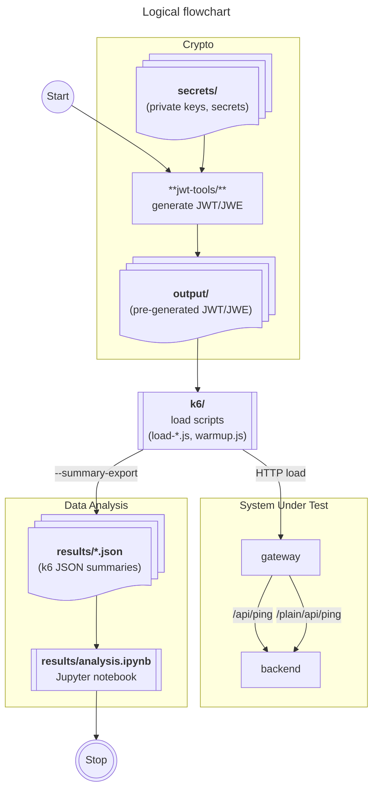

# JWT/JWE Spring Cloud Gateway Performance Bench

A reproducible benchmark suite for measuring **signature-verification** and **JWE-decryption** cost inside **Spring Cloud Gateway 2025.x** (Java 21, Nimbus JOSE).  
Each request carries a **unique token** to avoid hot-path inlining and show real event-loop crypto overhead.


```mermaid
---
title: Logical flowchart
---

flowchart

    START@{ shape: circle, label: "Start" }
    STOP@{ shape: dbl-circ, label: "Stop" }

    subgraph SUT["System Under Test"]
        GW["gateway"]
        BE["backend"]
    end

    subgraph Crypto["Crypto"]
        TOOLS["**jwt-tools/** <br> generate JWT/JWE"]
        SECRETS@{ shape: docs, label: "**secrets/** <br>(private keys, secrets)"}
        
        OUTPUT@{ shape: docs, label: "**output/** <br>(pre-generated JWT/JWE)"}
    end

    K6@{ shape: subproc, label: "**k6/** <br> load scripts <br> (load-*.js, warmup.js)" }
    
    subgraph DS["Data Analysis"]
        RESULTS@{ shape: docs, label: "**results/*.json** <br>(k6 JSON summaries)"}

        NB@{ shape: subproc, label: "**results/analysis.ipynb** <br> Jupyter notebook" }
    end

    START --> TOOLS
    
    SECRETS --> TOOLS 
    TOOLS --> OUTPUT

    OUTPUT --> K6
    K6 -->|HTTP load| GW

    GW -->|/api/ping| BE
    GW -->|/plain/api/ping| BE

    K6 -->|--summary-export| RESULTS
    RESULTS --> NB

    NB --> STOP
```

## How it works

Gateway classifies tokens on the fly:

- **HS256 / RS256 / ES256 / EdDSA** → `SignedJWT.parse` → `MACVerifier` / `RSASSAVerifier` / `ECDSAVerifier` / `Ed25519Verifier`
- **JWE** → `JWEObject.parse` → `RSADecrypter` (RSA-OAEP + AES-GCM)

Backend is intentionally trivial. The only measurable components are:

- Nimbus parsing & crypto;
- SCG routing;
- Netty event-loop saturation under pressure.

Token uniqueness removes JVM inline-caching and signature-reuse artifacts.

## Running the full benchmark

The `run.sh` script automates the end-to-end workflow: handles environment validation, dependency setup, 
token generation, container startup, readiness checks, and sequential execution of all k6 workloads.

See the script source for the exact sequence of operations.

### JCE provider comparison

Every k6 suite is re-run against three JCE provider configurations, controlled
by `CRYPTO_PROVIDER` env on the gateway container. Output filenames carry the
provider suffix so all three fit in the same `results/run-*` directory:

| mode      | suffix   | behind the scenes                                               |
|-----------|----------|-----------------------------------------------------------------|
| `default` | *(none)* | stock JDK providers: SunRsaSign / SunEC / SunJCE + Tink Ed25519 |
| `bc`      | `-bc`    | BouncyCastle inserted at priority 1 (pure Java)                 |
| `accp`    | `-accp`  | Amazon Corretto Crypto Provider (AWS-LC native via JNI)         |

Nimbus's `Ed25519Verifier` hard-codes Tink, so for `bc`/`accp` the gateway
routes EdDSA through a tiny JCA-based verifier (`JcaEd25519Verifier`) to let
the chosen provider actually service the scalar mult.

## What the bench reveals

- throughput changes across HS256 → RS256 → ES256 → EdDSA → JWE;
- latency behavior per algorithm;
- pressure on the Netty/SCG event loop;
- impact of raw cryptography with routing, without any application logic.

See [analysis.ipynb](results/analysis.ipynb) for the full analysis.

## Analysis environment

Python dependencies (Jupyter + Seaborn) are managed with [uv](https://docs.astral.sh/uv/).
Lockfile and Python version are checked in, so a single command reproduces the env:

```bash
uv sync
uv run jupyter lab results/analysis.ipynb
```

## License

This work is licensed under **CC BY-SA-4.0**. See [`LICENSE.md`](LICENSE.md) for attribution requirements.
